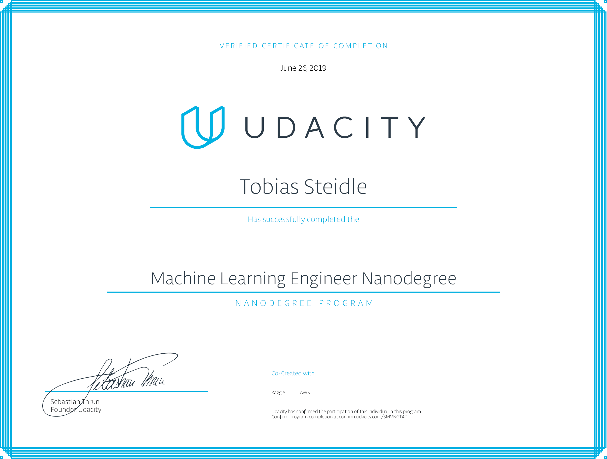

# MLND_Capstone
Machine Learning Engineer Nanodegree - Capstone Project




## Introduction
For my capstone project I chose the Kaggle Competition [LANL Earthquake Prediction](https://www.kaggle.com/c/LANL-Earthquake-Prediction/).  

Forecasting earthquakes is one of the most important problems in Earth science because of their devastating consequences.
Current scientific studies related to earthquake forecasting focus on three key points: when the event will
occur, where it will occur, and how large it will be.

The objective of this project is to predict the remaining time until laboratory earthquakes occur from
real-time seismic data.
Once this problem is solved, researchers will be able to better estimate and predict the seismic hazards.

This project is divided into two parts.  
The first part contains the [Proposal](Proposal.pdf) that describes the project backgrounds, datasets, etc. . 
The second part is the actual implementation.

## Project Instructions

1. Clone the repository and navigate to the downloaded folder.
```
https://github.com/tobiassteidle/MLND_Capstone.git
cd MLND_Capstone
```

2. Read the proposal ;-)
```
Proposal.pdf
```
Link to [Proposal Review](https://review.udacity.com/#!/reviews/1806638)

3. Read the Report ;-)
```
Report.pdf
```

4. Create and activate a new environment.   
Follow the instructions on [data/README.md](data/README.md).


5. Create and activate a new environment.
```
conda create -n capstone python=3.6
source activate capstone
```

6. Install Dependencies.
```
pip install -r requirements.txt
```

7. Create an [IPython kernel](http://ipython.readthedocs.io/en/stable/install/kernel_install.html) for the `capstone` environment. 
```
python -m ipykernel install --user --name capstone --display-name "capstone"
```

8. Open the notebook.
```
jupyter notebook MLND_Capstone.ipynb
```

79 Before running code, change the kernel to match the `capstone` environment by using the drop-down menu (**Kernel > Change kernel > capstone**). Then, follow the instructions in the notebook.


